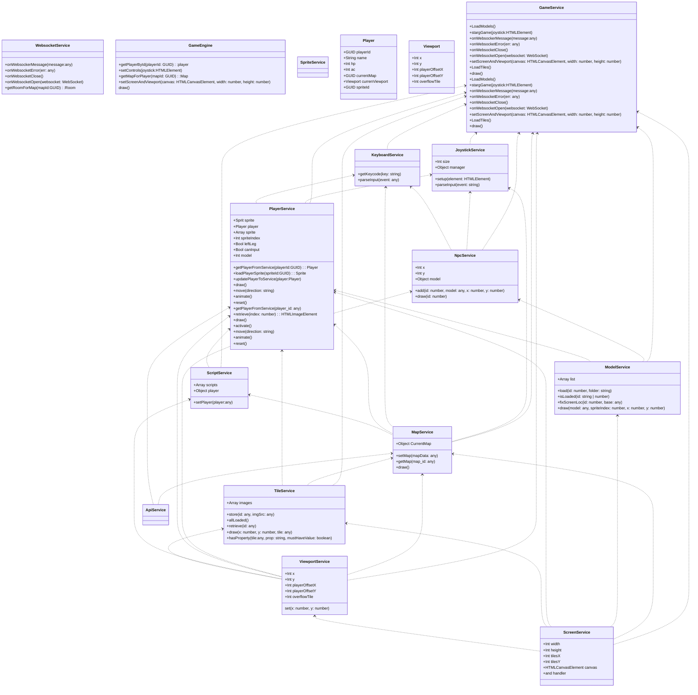

```mermaid
classDiagram


    class WebsocketService{
        +onWebsockerMessage(message:any)
        +onWebsocketError(err: any)
        +onWebsocketClose()
        +onWebsocketOpen(websocket: WebSocket)
        +getRoomForMap(mapId:GUID):Room
        
    }

    class GameEngine{
        +getPlayerById(playerId: GUID):player
        +setControls(joystick:HTMLElement)
        +getMapForPlayer(mapId: GUID):Map
        +setScreenAndViewport(canvas: HTMLCanvasElement, width: number, height: number)
        draw()
    }

    class SpriteService{

    }

    class PlayerService{
        +Sprit sprite
        +Player player
        +getPlayerFromService(playerId:GUID): Player
        +loadPlayerSprite(spriteId:GUID): Sprite
        +updatePlayerToService(player:Player)
        +draw()
        +move(direction: string)
        +animate()
        +reset()
    }

    class Player{
        +GUID playerId
        +String name
        +Int hp
        +Int ac
        +GUID currentMap
        +Viewport currenViewport
        +GUID spriteId
    }

    class Viewport{
        +Int x
        +Int y
        +Int playerOffsetX
        +Int playerOffsetY
        +Int overflowTile
    }

   class GameService{
        +LoadModels()
        +stargGame(joystick:HTMLElement)
        +onWebsockerMessage(message:any)
        +onWebsocketError(err: any)
        +onWebsocketClose()
        +onWebsocketOpen(websocket: WebSocket)
        +setScreenAndViewport(canvas: HTMLCanvasElement, width: number, height: number)
        +LoadTiles()
        +draw()
    }

    GameService <.. KeyboardService 
    GameService <.. PlayerService
    GameService <.. TileService
    GameService <.. ViewportService
    GameService <.. ScreenService
    GameService <.. MapService
    GameService <.. ModelService
    GameService <.. NpcService
    GameService <.. JoystickService
    GameService <.. ScriptService

    JoystickService <.. MapService
    JoystickService <.. PlayerService
    JoystickService <.. NpcService

    KeyboardService <.. MapService
    KeyboardService <.. PlayerService
    KeyboardService <.. NpcService

    MapService <.. ApiService
    MapService <.. ScreenService
    MapService <.. ViewportService
    MapService <.. TileService

    ModelService <.. ScreenService

    NpcService <.. ModelService
    NpcService <.. ViewportService

    PlayerService <.. ScreenService
    PlayerService <.. ViewportService
    PlayerService <.. MapService
    PlayerService <.. ScriptService
    PlayerService <.. ModelService
    PlayerService <.. TileService
    PlayerService <.. ApiService

    ScriptService <.. MapService
    ScriptService <.. ViewportService

    TileService <.. ScreenService
    TileService <.. ViewportService

    ViewportService <.. ScreenService

   class GameService{
        +LoadModels()
        +stargGame(joystick:HTMLElement)
        +onWebsockerMessage(message:any)
        +onWebsocketError(err: any)
        +onWebsocketClose()
        +onWebsocketOpen(websocket: WebSocket)
        +setScreenAndViewport(canvas: HTMLCanvasElement, width: number, height: number)
        +LoadTiles()
        +draw()
    }
    class JoystickService{
        +Int size
        +Object manager
        +setup(element: HTMLElement)
        +parseInput(event: string)
    }
    class KeyboardService{
        +getKeycode(key: string)
        +parseInput(event: any)
    }
    class MapService{
        +Object CurrentMap 
        +setMap(mapData: any)
        +getMap(map_id: any)
        +draw()
    }
    
    class ModelService {
        +Array list
        +load(id: number, folder: string)
        +isLoaded(id: string | number)
        +fixScreenLoc(id: number, base: any)
        +draw(model: any, spriteIndex: number, x: number, y: number)
    }

    class NpcService {
        +Int x
        +Int y
        +Object model
        +add(id: number, model: any, x: number, y: number)
        +draw(id: number)
    }

    class PlayerService{
        +Array sprite 
        +Int spriteIndex 
        +Bool leftLeg 
        +Bool canInput 
        +Int model 
        +getPlayerFromService(player_id: any)
        +retrieve(index: number): HTMLImageElement
        +draw()
        +activate()
        +move(direction: string)
        +animate()
        +reset()
    }

    class ScreenService{
        +Int width
        +Int height
        +Int tilesX
        +Int tilesY
        +HTMLCanvasElement canvas
        +and handler
    }
    class ScriptService { 
        +Array scripts
        +Object player
        +setPlayer(player:any)

    }
    class TileService {
        +Array images
        +store(id: any, imgSrc: any)
        +allLoaded()
        +retrieve(id: any)
        +draw(x: number, y: number, tile: any)
        +hasProperty(tile:any, prop: string, mustHaveValue: boolean)
     }

    class ViewportService {
        +Int x
        +Int y
        +Int playerOffsetX
        +Int playerOffsetY
        +Int overflowTile
        set(x: number, y: number)
     }
```