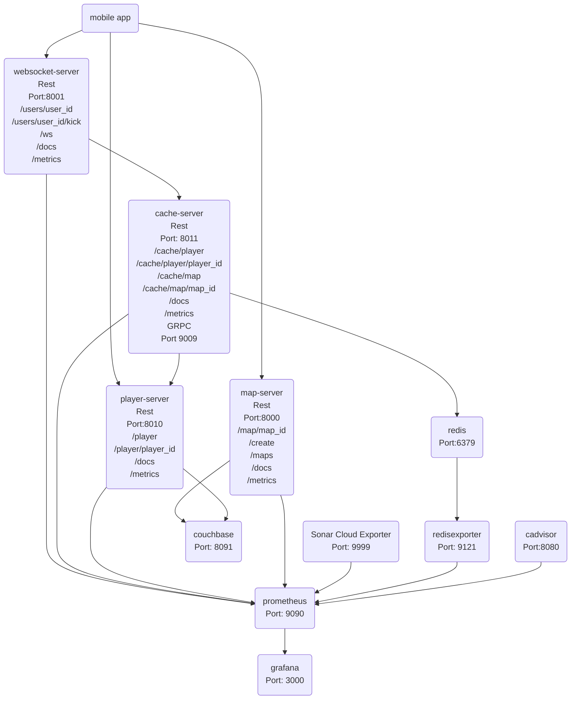

```mermaid
flowchart TD

    mobile-app(mobile app \n)
    websocket-server(websocket-server \n Rest \n Port:8001\n /users/user_id \n /users/user_id/kick \n /ws \n /docs \n /metrics)
    cache-server(cache-server \n Rest \n Port: 8011\n /cache/player \n /cache/player/player_id \n /cache/map \n /cache/map/map_id \n /docs \n /metrics\n GRPC \n Port 9009)
    player-server(player-server \n Rest \n Port:8010\n /player\n /player/player_id \n /docs \n /metrics)
    map-server(map-server \n Rest \n Port:8000 \n /map/map_id \n /create \n /maps \n /docs \n /metrics)

    sonarcloudexporter(Sonar Cloud Exporter \n Port: 9999 )
    cadvisor(cadvisor\n Port:8080)
    redis-exporter(redisexporter\n Port: 9121)
    grafana(grafana \n Port: 3000)
    couchbase(couchbase \n Port: 8091)
    prometheus(prometheus \n Port: 9090)
    redis(redis \n Port:6379)
    
    mobile-app --> websocket-server
    websocket-server --> cache-server
    mobile-app --> player-server
    mobile-app --> map-server
    cache-server --> player-server
    map-server --> couchbase
    player-server --> couchbase
    cache-server --> redis

    websocket-server --> prometheus
    cache-server --> prometheus
    player-server --> prometheus
    map-server --> prometheus
    sonarcloudexporter --> prometheus
    redis-exporter -->prometheus
    cadvisor --> prometheus
    prometheus --> grafana
    redis --> redis-exporter

```