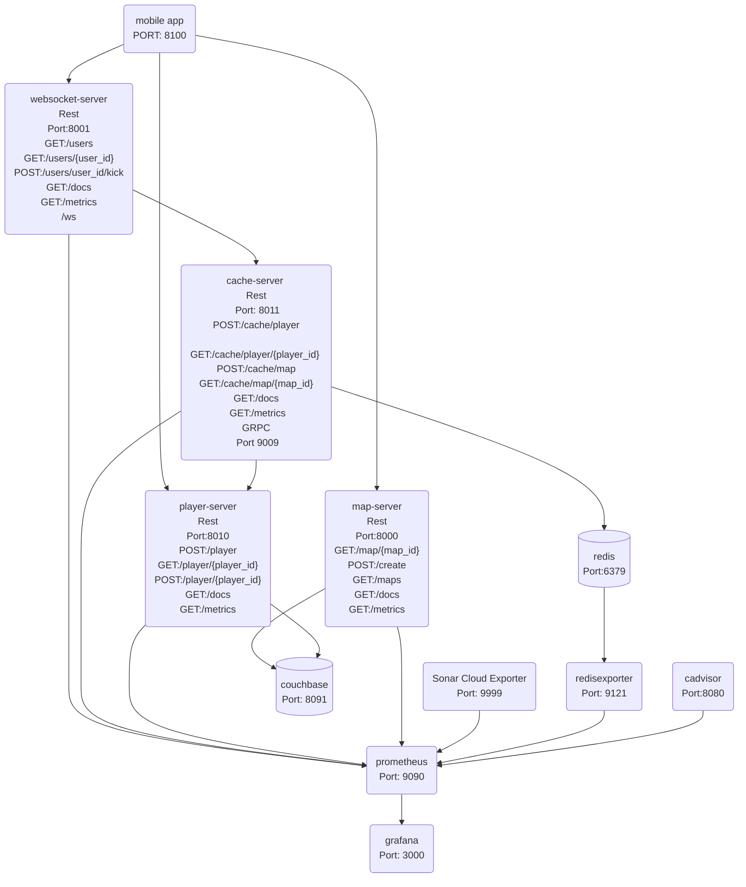

```mermaid
flowchart TD

    mobile-app(mobile app \n PORT: 8100)

    websocket-server("websocket-server \n Rest \n Port:8001\n GET:/users\n GET:/users/{user_id} \n POST:/users/user_id/kick \n GET:/docs \n GET:/metrics \n /ws ")

    cache-server("cache-server \n Rest \n Port: 8011\n POST:/cache/player \n GET:/cache/player/{player_id} \n POST:/cache/map \n GET:/cache/map/{map_id} \n GET:/docs \n GET:/metrics\n GRPC \n Port 9009")

    player-server("player-server \n Rest \n Port:8010\n POST:/player\n GET:/player/{player_id} \n POST:/player/{player_id} \n GET:/docs \n GET:/metrics")

    map-server("map-server \n Rest \n Port:8000 \n GET:/map/{map_id} \n POST:/create \n GET:/maps \n GET:/docs \n GET:/metrics")

    sonarcloudexporter(Sonar Cloud Exporter \n Port: 9999 )

    cadvisor(cadvisor\n Port:8080)

    redis-exporter(redisexporter\n Port: 9121)
    grafana(grafana \n Port: 3000)
    couchbase[(couchbase \n Port: 8091)]
    prometheus(prometheus \n Port: 9090)
    redis[(redis \n Port:6379)]
    
    mobile-app --> websocket-server
    websocket-server --> cache-server
    mobile-app --> player-server
    mobile-app --> map-server
    cache-server --> player-server
    map-server --> couchbase
    player-server --> couchbase
    cache-server --> redis

    websocket-server --> prometheus
    cache-server --> prometheus
    player-server --> prometheus
    map-server --> prometheus
    sonarcloudexporter --> prometheus
    redis-exporter -->prometheus
    cadvisor --> prometheus
    prometheus --> grafana
    redis --> redis-exporter

```